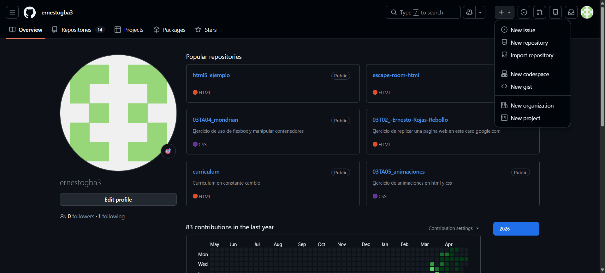
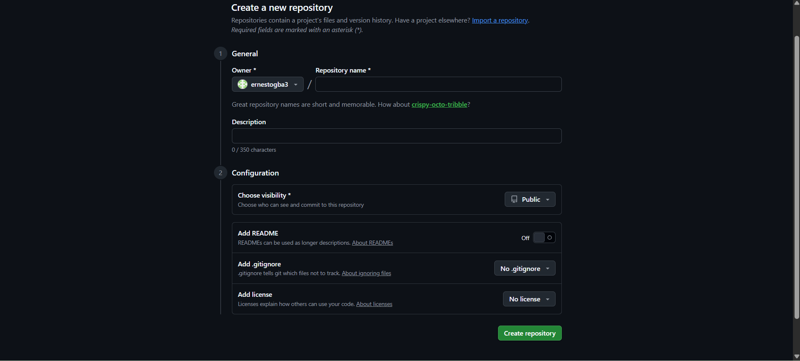

# Guía básica de Git y Github
---
## Introducción
**¿Que es Git?**
Git es un sistema de control de versiones, es decir, una herramienta que permite guardar y gestionar los cambios que haces en archivos (especialmente código) a lo largo del tiempo

**¿Que es GitHub?**
GitHub es una plataforma online donde puedes guardar proyectos que usan Git y colaborar con otras personas.

---
## Comandos básicos de Git

``` Git
git init "Inicia el git en tu proyecto de forma local."
```

``` Git
git commit -m "Cambio que hayas hecho en el proyecto."
```

``` Git
git branch -M main "Cambias el nombre de
la rama principal de master a main."
```

``` Git
git remote add origin url "Apuntas tu git local al repositorio alojado en GitHub."
```

``` Git
git push -u origin main "Subes el cambio al repositorio remoto de GitHub,."
```

``` Git
git clone url "copias el directorio alojado en GitHub en tu ordenador, sino lo tienes ya."
```

``` Git
git pull origin main "Se descarga los ultimos cambios del proyecto."
```

---

## Flujo de trabajo

1. Crear repositorio

1.1. Inicias sesion en GitHub.


1.2. Haces click en nuevo repositorio.


1.3. Rellenar campos que necesites.


2. Añadir archivos

``` Git
1.git init
2.git add .(Añades todos los archivos del proyecto/ git add nombre_del_archivo(Añades dicho archivo unicamente))

```

3. Hacer commit

``` Git

3.git commit -m "mensaje"
4.git branch -M main (Si no usas este comando por defecto tu branch principal sera master)
```

4. Subir a GitHub

``` Git

4.git remote add origin "url" (Solo la primera vez que vinculas tu proyecto en local(Git) con tu repositorio en Github)
5.git push -u origin main
```
